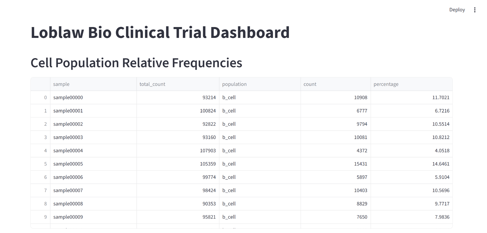

# Will Borrelli Teiko Technical 

Code to create a database, run statistical analysis, and create an interactive web dashboard for bioinformatics data.

## Instructions
The Makefile has several options:
- setup: install the necessary requirements from requirements.txt
- pipeline: run the full analysis pipeline
    - creates: 
        - boxplots.png: box and whisker plots for cell type frequency statistics
        - bar_charts.png: bar charts of subject counts
        - results.txt: grid formatted summary statistics table for each sample and p-value statistics for cell type frequencies
    - additionally, the box plots bar charts will be printed to the screen
- dashboard: starts the interactive web dashboard (http://localhost:8501)
- clean: cleans up created files

## Data Schema
The data schema used has the following form: (project TEXT, subject TEXT, condition TEXT, age INTEGER, sex TEXT, treatment TEXT, response TEXT, sample TEXT, sample_type TEXT, time_from_treatment_start INTEGER, b_cell INTEGER, cd8_t_cell INTEGER, cd4_t_cell INTEGER, nk_cell INTEGER, monocyte INTEGER).

This schema loads the necessary fields in a very straightforward way that is amenable to both out of memory and in memory analysis. To scale to much larger data sets I would convert the smaller in memory tasks (using pandas) to exclusively SQLite3 out of memory tasks.

## Code Structure
### load_data.py
- simply loads the csv data into a sqlite3 database file
### cell_analysis.py
- due to the relatively small data set the analyses in this script just pull the previously created database into memory with pandas
- total cell counts and relative frequencies are computed per sample and a formatted table is printed
- the dataset is filtered to rows with condition=melanoma,treatment=miraclib,sample_type=PBMC, then further filtered into responders vs. non-responders
- box and whisker plots of relative frequencies are plotted and statistical significance is calculated, and output to the screen and saved
- bar charts of samples per project, subjects that are responders or non-responders, and male vs. female subject counts are output to the screen and saved
### dashboard.py
- the computations mirror those in the "cell_analysis.py" script
- dashboarding is handled by streamlit

